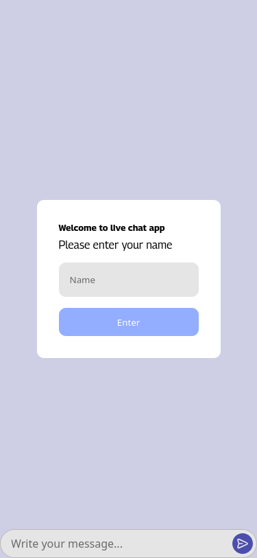
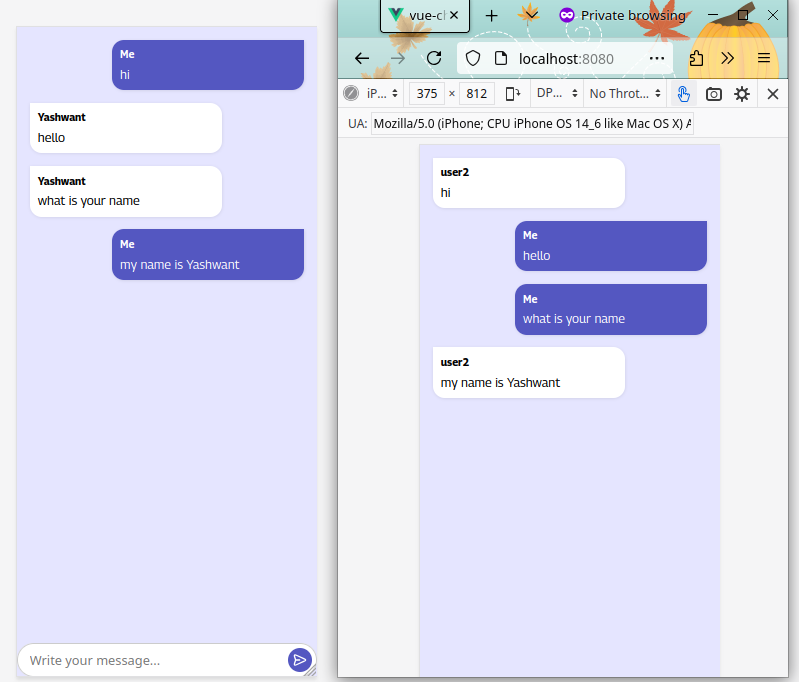

# Simple Vue.js Chat App with Socket.IO

This project is a minimal, real-time chat application built using Vue.js and Socket.IO.
It’s a great starting point to learn how to integrate WebSockets with Vue and create a live chat feature.

---

## Features

- Real-time messaging using Socket.IO
- Clean and minimal UI
- Modular Vue.js components
- Easy to extend and customize

---

## Getting Started

Follow these steps to run the project:

1. **Install dependencies**

   ```bash
   npm install 
```

2. **Start the development server**

   ```bash
   npm run dev
   ```
---

## Example Screenshot





---

## Project Structure (Optional)

```
├── public/
├── src/
│   ├── components/
│   │   ├── ChatBox.vue          # Input box to send messages
│   │   ├── Message.vue          # Renders individual messages
│   │   └── RegisterDialog.vue   # Dialog to set a username
│   ├── core/
│   │   ├── server.js            # Node.js + Socket.IO backend server
│   │   └── socket.ts            # Frontend socket logic
│   ├── App.vue                  # Main Vue component
│   └── main.js                  # App entry point
├── package.json
└── README.md
```

---